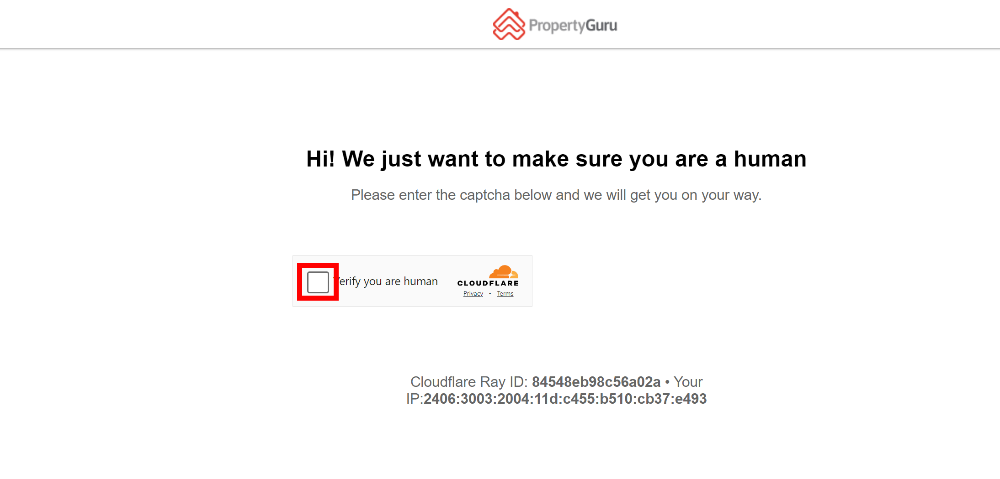
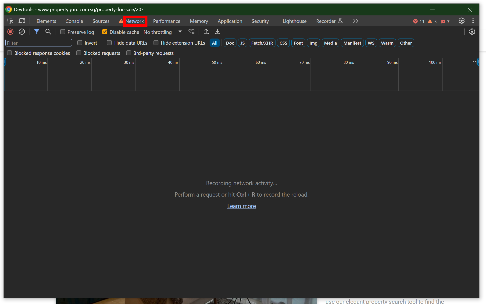
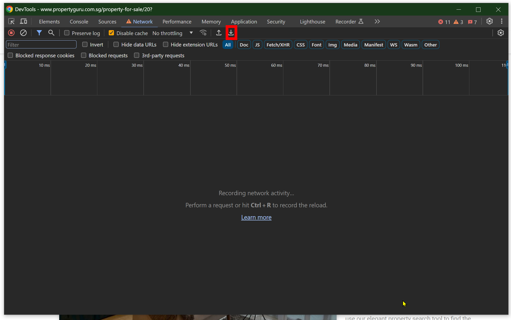
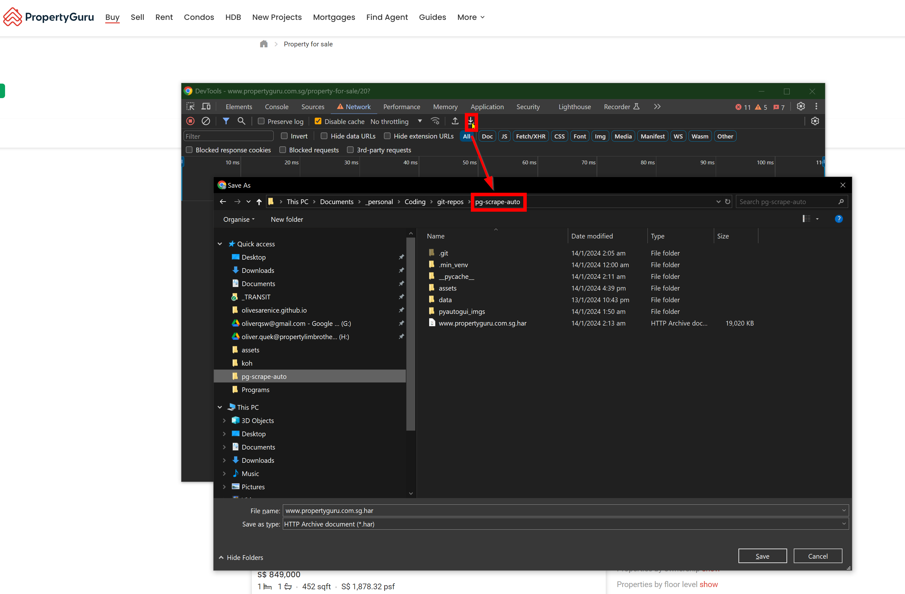

# Introduction

This is a tool that will automatically scrape and clean all listing data from [PropertyGuru](https://www.propertyguru.com.sg/property-for-sale), saving the cleaned tables (snapshots) in your local machine. Each run takes about 30 mins and downloads ~40,000 listings over 2,000+ webpages. The scripts can run in the background once the initial bot bypass is complete (< 1 min). It works with minimal configuration on Windows platform, although can be adapted for Linux machines as well. Your machine will need a display, or a way to emulate a display, as it relies on PyAutoGUI to pass bot detection. 

This data can then be used for various purposes such as monitoring changes over time in listings by categories.

# Setup (Windows)

Clone the repo

    git clone https://github.com/olivesarenice/pg-scrape-auto.git

Then create a `.venv` inside the repo

    python -m venv .venv && .venv\Scripts\activate && pip install -r requirements.txt

## Add local configurations

Before running `pipeline.bat`, prepare these 2 items:

1. Create custom screenshots for your browser inside `pyautogui_imgs/`

    Because each machine has its own resolution and each browser has different themes/ colours/ fonts, you need to create the reference images that pyautogui will use to identify the items that need clicking during bot bypass.

    - `target.png` is the CAPTCHA box:
        

    - `network.png` and `network2.png` are the Network tabs in the Inspect window, when selected and de-selected (the order doesn't really matter)
        
        

    - `exp_har.png` is the Export HAR button in the Inspect > Network window.
        

    Open the same windows inside your Chrome browser and screenshot and save the files as necessary. Reference can be found inside `pyautogui_imgs/`.

2. Change settings in `config.json`

        {
            "test_run":0,   #  By default set to 0 which will download all pages. Change to 1 to test the pipeline works - will only download the first 25 pages to test. 
            "path_to_chrome":"C:/Program Files/Google/Chrome/Application/chrome.exe",   # Path to your Chrome executable
            "path_to_imgs":{    # Leave as is if you saved the images to the same folder as the repo, and under the same names.
                "captcha_box":"pyautogui_imgs/target.png", 
                "network_unfocus":"pyautogui_imgs/network.png",
                "network_focus":"pyautogui_imgs/network2.png",
                "export_har":"pyautogui_imgs/exp_har.png"
            },
            "path_to_data_htmls":"data/dl-htmls", # Leave as is
            "path_to_har":"." # Leave as is, but check that when you manually click Export HAR, it is set to save to this repo. See image below:

        }

    You may need to manually go through the actions once so that your browser remembers to save HAR files to this repo:

    1. Go to [https://www.propertyguru.com.sg/property-for-sale/20?] and pass the CAPTCHA
    2. Ctrl-Shift-I to open Inspect, go to Network tab, click on Export HAR..
    3. Change the save directory to this repo `pg-scrap-auto/`
    4. Confirm save and replace to lock in the setting.

    

## Usage

After setup and config, run `pipeline.bat` and it will automatically scrape and save the clean table into `data/processed-df/cleaned/` with the timestamp as a `.zip` file of ~5MB. 

# How it works

The `.bat` file runs 3 scripts in sequence prioritising the Scrape First, Parse Later approach:

1. `scrape_propguru.py`

    - Uses pyautogui to control your browser and pass the CAPTCHA. Then saves the headers which contain the verified Cloudflare cookies which will let you send `GET` requests unobstructed for up to 30 mins from the initial CAPTCHA.

    - Using these headers, send the requests in 8 parallel threads to get all 2000+ listing pages. For each webpage, save the HTML into `data/dl-htmls/`. Takes about 15-20 mins depending on Cloudflare throttling. This downloads about ~500MB of webpages.

2. `process-listings.py`

    - Loops through each HTML page and extracts the relevant information using BeautifulSoup and pattern matching. Takes about 10 mins and is CPU-bound.

    - Combines the data from the pages into a single dataframe with the relevant data columns

3. `clean-table.py`

    - Final string cleaning, typing, and additional calculations to arrive at a useable table stored in `data/processed-df/cleaned/<TIMESTAMP>.csv.zip`

The scripts automatically delete the intermediate files such as the HTML files and prelim tables. Only the final table is stored per run to save space.

**The entire tool is premised on using headers from the HAR file containing a valid cookie that has been granted by Cloudflare after passing bot detection, hence the need for pyautogui to fool the CAPTCHA**

Note that the URL `https://www.propertyguru.com.sg/property-for-sale/20?` is used to get the HAR file because PropertyGuru only turns on the CAPTCHA page for requests going to pages 20 and above. 

The rest of the script is standard scraping using `requests` and data cleaning using `pandas`.

# Issues

## `requests.get` returns weird symbols and cannot be parsed:

Needed to install `brotli`. This is already included in `requirements.txt`. See this [SO issue](https://stackoverflow.com/questions/49702214/python-requests-response-encoded-in-utf-8-but-cannot-be-decoded)

